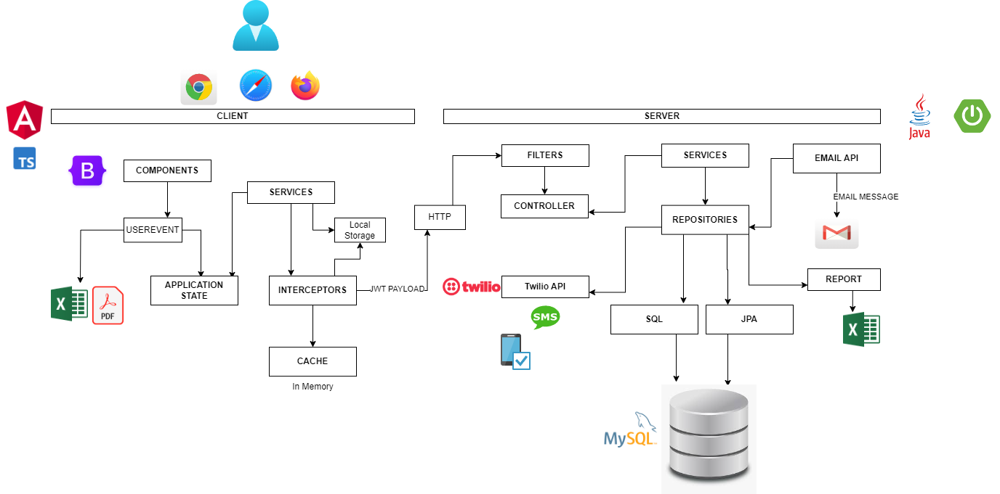

# PharmacyApp

;

Pharmacy App Software Documentation

## Table of Contents

1. [Introduction](#introduction)
2. [Functional Requirements](#functional-requirements)
3. [Non-Functional Requirements](#non-functional-requirements)
4. [Technology Stack](#technology-stack)
5. [Suggested Improvements](#suggested-improvements)
6. [Conclusion](#conclusion)

## 1. Introduction

The Pharmacy App is a web-based application designed to streamline pharmacy operations and provide an efficient platform for managing customers, inventory, prescriptions, medications, and invoices. The app aims to simplify the process of managing pharmacy-related tasks, enhancing customer experience, and improving overall operational efficiency.

;

## 2. Technology Stack

The Pharmacy App utilizes the following technology stack:

### Backend

- Java 19
- Spring Boot framework
- MySQL Workbench Relational Database
- Lombok for code generation
- Spring JDBC for database connectivity

### Frontend

- Angular (TypeScript)
- Bootstrap for responsive UI design
- HTML and CSS (latest versions) for markup and styling

## 3. Functional Requirements

The Pharmacy App includes the following functional requirements:

# Application Overview

## Database Structure

### **1. User Creation**

- Users are created with various attributes:
  - first name
  - middle name
  - last name
  - email
  - password
- Tables:
  - `Users`: Stores user-related information
  - `Roles`: Defines different user roles (USER, MANAGER, ADMIN, SYSADMIN)
  - `UserRoles`: Establishes a many-to-many relationship between users and roles

### **2. Customer Creation**

- Customers are associated with users.
- Customer information (city, state, zip code) is stored in the `Customers` table.
- The `Customers` table has a foreign key relationship with the `Users` table.

### **3. Security and Confirmation**

- `Confirmations` table: Stores confirmation tokens for email verification
- `TwoFactorVerifications` table: Implements two-factor verification

### **4. Events and Logging**

- `Events` table: Logs events related to user actions
- `UserEvents` table: Stores user-specific events

### **5. Password Reset**

- `ResetPasswordVerifications` table: Stores URLs for password reset

### **6. Prescriptions and Medications**

- `Prescriptions` table: Stores prescriptions associated with customers
- `Medications` table: Stores medications associated with prescriptions

### **7. Inventory and Invoices**

- `Inventory` table: Stores inventory items associated with medications
- `Invoices` table: Stores invoices associated with customers

### **8. Database Initialization**

- `schema.sql`: Contains the SQL script to create tables and relationships
- Sample data is inserted using SQL statements

## 4. Non-Functional Requirements

The Pharmacy App includes the following non-functional requirements:

### Performance

- The application should handle a large number of concurrent users without significant performance degradation
- Database queries should be optimized to ensure fast and efficient data retrieval and updates

### Security

- User authentication and authorization should be implemented securely using industry best practices
- User passwords should be stored securely using encryption techniques
- User sessions should be managed securely to prevent unauthorized access

### Usability

- The user interface should be intuitive and user-friendly
- Proper validation and error handling should be implemented to provide informative feedback to users
- The application should be responsive and compatible with different devices and screen sizes

### Reliability

- The application should be highly reliable and available, with minimal downtime
- Data integrity should be maintained, ensuring accurate and consistent information storage and retrieval

## 5. Suggested Improvements

- **Consistent Naming:** Ensure consistent naming conventions across classes, methods, and properties.
- **Exception Handling:** Enhance exception handling to provide informative error messages.
- **DTOs (Data Transfer Objects):** Consider using DTOs to separate entities from data sent to the client.
- **Validation:** Implement validation for user inputs to ensure data integrity and security.
- **Logging:** Improve logging mechanisms for better debugging and monitoring.
- **Service Layer:** Introduce a service layer to encapsulate business logic, making code more modular.
- **Frontend Interaction:** Enhance frontend interaction with better error messages, user feedback, and intuitive UI.
- **Security Measures:** Implement best practices for security, such as password hashing, SQL injection protection, and secure communication.
- **Documentation:** Provide comprehensive documentation for future developers, including API documentation, code comments, and architecture overview.
- **Testing:** Implement thorough testing, including unit tests and integration tests, to ensure reliability.

**Note:** These are general suggestions, and specific improvements depend on the application's needs and goals.

## 6. Conclusion

This Pharmacy App Software Documentation provides an overview of the application, including its functional and non-functional requirements, as well as the technology stack used for development. By adhering to these requirements and leveraging the specified technologies, the app aims to provide an efficient and user-friendly solution for managing pharmacy operations.
